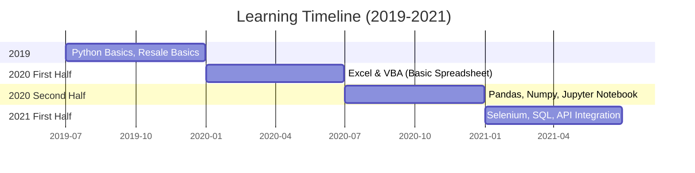
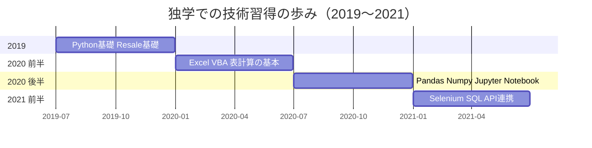

# Resale Automation Pipeline

## Overview
This repository contains a suite of Python scripts and automation tools I developed to streamline and fully automate e-commerce resale operations. The system was built out of a personal need to replace repetitive manual data entry, scraping, and inventory management tasks across multiple online marketplaces.

It acts as a complete data processing pipeline: scraping pricing data, normalizing item attributes, and seamlessly transferring updates between different services (e.g., executing cross-platform inventory syncs or generating listing manifests).

## Learning Timeline (2019-2021)

## Pipeline Architecture
1. **Scraping Layer (Multi-Source):** `mBall_yahoo*.py`
    - Uses BeautifulSoup4, Requests, Pandas, and Numpy to extract and preprocess raw product data from Yahoo and other sources.
2. **Data Processing & Normalization:** `local-heroku_sql.py` / `prototypes/*.ipynb`
    - Cleans raw input, resolves encoding issues, and maps marketplace attributes to a unified database schema.
3. **Automated Sync & Listing:** `syuppin_ebay*.py` / `zaico_yahoo.py`
    - Handles Selenium-based browser automation, automated cross-platform listing on eBay, and inventory synchronization with external services like Zaico.
4. **Execution Stability:** (Built into all scripts)
    - Basic Python `try...except` exception handling and `time.sleep` rate limiting as fundamental practices.

## Why I Built This
This toolset was created to solve a real-world operational bottleneck. Moving products between marketplaces manually is error-prone and unscalable. By automating the extraction and posting logic, I could ensure data integrity while saving hundreds of hours of manual labor. 

*Note: For security reasons, all sensitive API keys, hardcoded credentials, and proprietary marketplace endpoint details have been removed or mocked in this public archive.*

---

# (Japanese) Resale Automation Pipeline

## 概要
このリポジトリは、Eコマースにおける転売・在庫管理オペレーションを完全自動化するために開発したPythonスクリプトおよび自動化ツールのコレクションです。複数のオンラインマーケットプレイスにまたがる手動でのデータ入力、スクレイピング、在庫管理の手間という個人的な課題を解決するために構築しました。

商品の価格データの収集から属性の正規化、そして異なるサービス間でのデータ同期（例：クロスプラットフォームでの在庫連携や出品リストの自動生成）までを担う、End-to-Endのデータ処理パイプラインとして機能します。

## 独学での技術習得の歩み

## パイプラインの構成
1. **スクレイピング層 (マルチソース対応):** `mBall_yahoo*.py`
    - BeautifulSoup4、Requests、Pandas、Numpyを用い、Yahoo等から商品データを抽出・前処理します。
2. **データの整形と正規化:** `local-heroku_sql.py` / `prototypes/*.ipynb`
    - 未加工のデータをクレンジングし、内部DBや共通フォーマットに変換・正規化します。
3. **在庫・価格の自動同期:** `syuppin_ebay*.py` / `zaico_yahoo.py`
    - Seleniumを用いたブラウザ自動操作、eBayへの自動出品や、Zaico等の外部ツールと連携した在庫の自動同期を担います。
4. **実行の安定化:** (各スクリプトに実装)
    - Python基礎としての`try...except`例外処理と`time.sleep`制限回避を適宜組み合わせています。

## 開発の背景
このツールは、現実のオペレーションにおけるボトルネックを解消するために作成しました。マーケットプレイス間で手動で商品を移動・管理するのはミスが起きやすく、スケールしません。データ抽出から出品までのロジックをプログラマブルに処理することで、データの整合性を担保しつつ、膨大な手作業の時間を削減しました。

*※セキュリティの観点から、公開アーカイブである本リポジトリではAPIキー、認証情報、および特定の非公開マーケットプレイスのエンドポイント等の機密情報は削除またはモック化しています。*